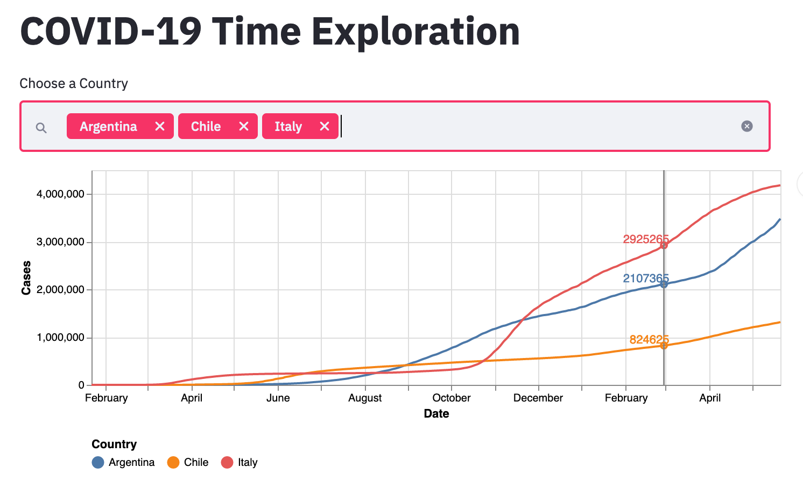

## COVID-19 Dashboard
> 
> This repository contains the code for the maintenance of the Covid19 Dasboard that is publicly accessible at: https://hidden-fjord-23808.herokuapp.com/
> 
> The Data is loaded every time the web-site is accessed from: [Johns Hopkins University COVID-19 Data Repository](https://github.com/CSSEGISandData/COVID-19)  
> 
> 
> ### What it is displayed
> 
> The dashboard displays confirmed, active, deaths and recoveries cumulative cases since the start of the pandemic. The dash shows some other derived index as well.  
> 
> The spirit of the dashboard is allows you to compare the evolution for cases of the countries your choise. THe above is an overview of the dashboard. 
> 
> 
> 
> 
> ### For developers 
> 
> The app is a streamlit running in heroku. You can find most of the productive code in app.py.
> Feel free to leave comments or PR.
> 
> Hope you enjoy it!!!
> 